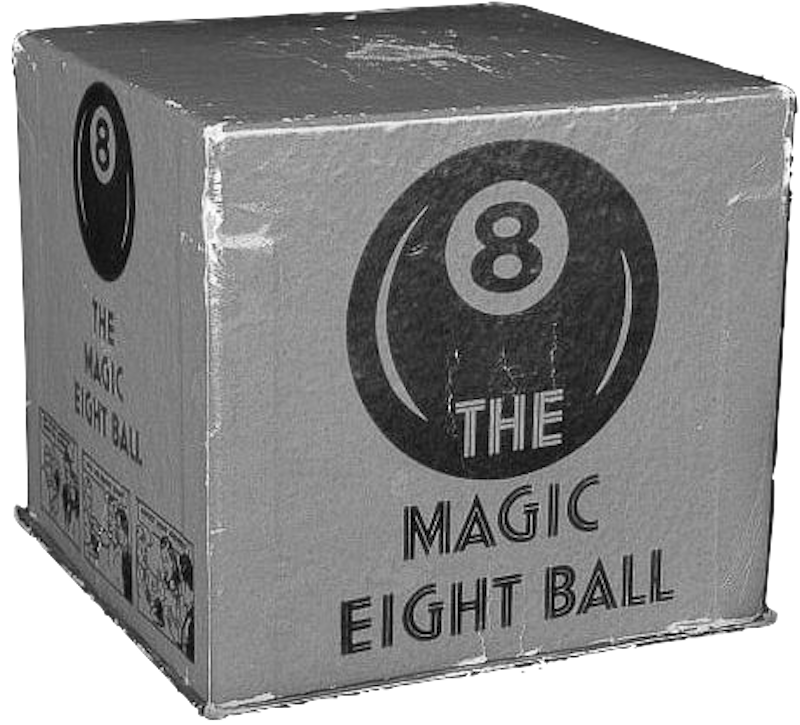

<h1 align="center">
  MAGIC 8 BALL
</h1>
<h4 align="center">
  
</h4>

**Magic 8 ball** (рус. магический шар 8) - игра, написана на языке программирования Ruby.

Приветствие в игре сделано на 19 языках мира.

---

## Запуск и использование :wrench:

Необходимо установить интерпретатор [Ruby](https://www.ruby-lang.org/en/downloads/), далее запустите игру через консоль командой: 

```ruby 
$ ruby 8ballmagic.rb 
```

предварительно задумайте мысленно вопрос, на который хотите получить ответ :video_game:

>   [Интересные факты об игре в Wikipedia](https://ru.wikipedia.org/wiki/Magic_8_ball)
